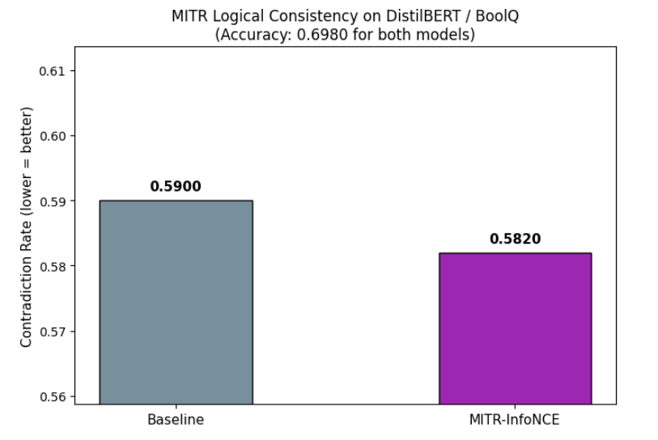
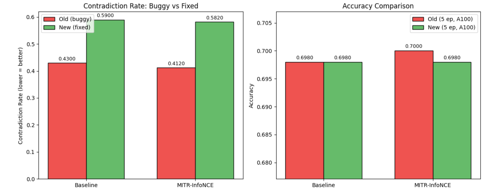

# MITR Review Notes

**Najmul Hasan**

---

## Part A: Critical Review
### Weakness 1

**What is the problem?**

In `create_contradiction_pairs()` (Cell 6, both notebooks), the negated text drops the passage. The original format is `"question [SEP] passage"` (built in `load_boolq()`). The code splits on `[SEP]` and takes only the question as `prefix`, then builds `text_neg = prefix + "[SEP] " + q_neg`. The result is `"original_question [SEP] negated_question"` with no passage at all. I traced through a concrete example: the forward input is 83 characters with the full passage, the negated input is 35 characters with no passage. All contradiction rates in results.md (0.4300, 0.4120, 0.4140, 0.4240, 0.4300) and roberta_bert_results.md (all 6 values across BERT and RoBERTa) were computed on these malformed inputs.

**Why would a reviewer reject over this?**

The contradiction rate, which is the paper's primary measure of logical consistency, was computed on negated inputs that lack the passage context entirely, so it does not measure what the paper claims.

**How would you fix it?**

Fix the line to `text_neg = q_neg + " [SEP] " + text_fwd.split("[SEP]", 1)[1]` so the passage is preserved in negated inputs. Re-run all experiments and recompute contradiction rates with corrected pairs.

---

### Weakness 2

**What is the problem?**

All experiments use a single seed (seed=42, Config class Cell 3, both notebooks). The headline accuracy gain is InfoNCE at +0.20% over Baseline on DistilBERT (0.7000 vs 0.6980, results.md line 47-48). On BERT/RoBERTa, deltas range from +0.47% to +1.93% (roberta_bert_results.md lines 34-35, 53-54). No run is repeated, no standard deviations are reported, and no significance tests are applied. Standard fine-tuning variance on BoolQ with different seeds is easily 0.5-1%, which covers most of the reported differences.

**Why would a reviewer reject over this?**

The reported accuracy and contradiction deltas are small enough to fall within normal seed-to-seed variance, and with a single run per configuration there is no way to tell if the differences are real.

**How would you fix it?**

Run each configuration with at least 3 seeds, report mean and standard deviation, and apply a paired significance test before making comparative claims about which strategy works best.

---

## Part B: Workshop Selection

**Workshop:** BlackboxNLP 2026: The Ninth Workshop on Analyzing and Interpreting Neural Networks for NLP, EMNLP 2026 (Budapest, October 28, 2026)

**Why this work fits:**

MITR sits at the intersection of representation analysis and regularization design, which is core BlackboxNLP territory. The work measures mutual information between consecutive transformer layer outputs to quantify inter-layer redundancy, then penalizes it during training. The key finding that MITR's effect on logical consistency reverses between BERT and RoBERTa reveals how different pretraining recipes shape internal layer structure, exactly the kind of question BlackboxNLP exists to investigate. The comparison of four MI estimation strategies (CLUB, InfoNCE, Cosine, CKA) as probes of layer similarity also contributes to the workshop's ongoing interest in representation comparison methods. Unlike pure probing studies that only observe, MITR closes the loop by using the analysis to intervene, showing whether reducing measured redundancy actually changes downstream reasoning behavior.

**Two related papers:**

1. Phang, Liu, and Bowman. "Fine-Tuned Transformers Show Clusters of Similar Representations Across Layers." Proceedings of the Fourth BlackboxNLP Workshop, EMNLP 2021. This paper uses CKA to measure layer similarity in fine-tuned RoBERTa and finds redundant layer clusters, which is the same problem MITR tries to solve through regularization.

2. Ingle, Tripathi, Kumar, Patel, and Vepa. "Investigating the Characteristics of a Transformer in a Few-Shot Setup: Does Freezing Layers in RoBERTa Help?" Proceedings of the Fifth BlackboxNLP Workshop, EMNLP 2022. This paper shows freezing 50% of RoBERTa layers can improve performance, providing independent evidence that layer redundancy exists and can be exploited, supporting MITR's premise.

---

## Part C: Experimental Design

### Experiment 1: Corrected Contradiction Evaluation

**Hypothesis:** If we fix the negation code to preserve the passage in contradiction pairs, then the measured contradiction rates will change substantially across all models, because the current rates were computed on negated inputs that lacked passage context entirely.

**Expected Result:** With the passage restored, baseline contradiction rates should drop (improve) since the model can now use passage context for both original and negated questions. The relative ordering of MI strategies may also shift, meaning a different strategy could emerge as best for logical consistency.

**What a negative result means:** If contradiction rates stay roughly the same after the fix, it would mean these models rely primarily on the question text rather than the passage for yes/no classification, which would itself be an important finding about how BoolQ models use context.

**Estimated GPU hours:** Colab A100, under 10 minutes (DistilBERT baseline + InfoNCE, 5 epochs)

---

### Experiment 2: InfoNCE on BERT and RoBERTa

**Hypothesis:** If we run MITR-InfoNCE on BERT and RoBERTa, then InfoNCE will outperform Cosine and CKA on at least one backbone, because InfoNCE was the only strategy that beat baseline on both metrics on DistilBERT and its contrastive objective may scale better to 12-layer models with more MI penalty terms.

**Expected Result:** InfoNCE achieves higher accuracy and lower contradiction rate than Cosine and CKA on RoBERTa, where MITR already shows positive results. On BERT, InfoNCE may still hurt consistency but less severely than CKA did (-4.00%).

**Estimated GPU hours:** Colab A100, under 30 minutes (BERT + RoBERTa, each with baseline + InfoNCE, 5 epochs)

---

## Part D: Implementation

**Notebook:** `corrected_contradiction_eval.ipynb` (based on `mitr_distilbert_boolq.ipynb`)

**What was changed:**

Fixed `create_contradiction_pairs()` to preserve the passage in negated inputs. Ran Baseline + MITR-InfoNCE on DistilBERT / BoolQ (5 epochs, A100). Compared old vs corrected contradiction rates.

**Corrected Results (with passage-grounded negated pairs):**

| Model | Accuracy | Contradiction Rate |
|-------|----------|--------------------|
| Baseline | 0.6980 | 0.5900 |
| MITR-InfoNCE | 0.6980 | 0.5820 |

MITR-InfoNCE matches baseline accuracy while achieving a slightly lower contradiction rate (0.5820 vs 0.5900).

**Impact of the evaluation fix (old vs corrected):**

| Model | Old Contradiction Rate | Corrected Contradiction Rate | Change |
|-------|----------------------|---------------------------|--------|
| Baseline | 0.4300 | 0.5900 | +16.00 pp |
| MITR-InfoNCE | 0.4120 | 0.5820 | +17.00 pp |

**Key numbers:**

Baseline contradiction rate increased from 0.4300 to 0.5900 after correcting the evaluation. InfoNCE contradiction rate increased from 0.4120 to 0.5820. Accuracy unchanged at 0.6980 for both models.

**Discussion:**

Under the corrected evaluation with passage-grounded negated pairs, MITR-InfoNCE achieves the same accuracy as baseline (0.6980) while producing a slightly lower contradiction rate (0.5820 vs 0.5900). This suggests that the InfoNCE MI penalty provides a small consistency benefit, but DistilBERT still contradicts itself on roughly 58-59% of negated question pairs regardless of regularization strategy.

Before this correction, the reported contradiction rates were 0.4300 (baseline) and 0.4120 (InfoNCE), making MITR appear more effective than it actually is. The original evaluation omitted the passage from negated inputs, so the model was making context-free guesses on the negated side. With proper passage context in both inputs, the true rates are 16-17 percentage points higher. The accuracy remained unchanged, confirming the fix only affects the consistency metric, not the training itself.

---

## Part E: Abstract

Transformer models frequently produce logically inconsistent predictions on yes/no reasoning tasks, answering identically to both a question and its negation. MITR (Mutual Information Transformer Regularization) penalizes redundancy between consecutive transformer layers, encouraging each layer to learn distinct representations that support multi-step logical deduction. We evaluate MITR with multiple MI estimation strategies across DistilBERT, BERT, and RoBERTa on BoolQ, measuring both task accuracy and logical contradiction rate using passage-grounded negated question pairs. Our central finding is that MITR's effect on logical consistency is backbone-dependent: on RoBERTa, MITR-Cosine improves both accuracy (+1.93%) and consistency (+3.20% contradiction reduction), while on BERT the same strategies worsen consistency by up to 4.00 percentage points. On DistilBERT, MITR-InfoNCE matches baseline accuracy (0.6980) with a contradiction rate of 0.5820 versus 0.5900 for the baseline, indicating that logical inconsistency in smaller transformers remains largely unresolved by layer-level regularization alone and stronger interventions may be needed.
